# Entidades Core — Schema do banco

> 30+ tabelas críticas. Use como referência de schema completo.

## Diagrama Mermaid

```mermaid
erDiagram
  PROFILES ||--o{ ORGANIZATION_MEMBERS : "is member"
  ORGANIZATIONS ||--o{ ORGANIZATION_MEMBERS : "has members"
  ORGANIZATIONS ||--o{ ORGANIZATION_INVITES : "has pending"
  ORGANIZATIONS ||--|| ONBOARDING_SESSIONS : "1 onboarding"
  ORGANIZATIONS ||--|| USER_JOURNEYS : "1 active journey"
  
  USER_JOURNEYS ||--o{ MISSIONS : "has 7 etapas"
  MISSIONS ||--o{ MISSION_TASKS : "has tasks"
  USER_JOURNEYS ||--o{ JOURNEY_TRACKS : "vincula projects"
  USER_JOURNEYS ||--o{ JOURNEY_STACK_TOOLS : "tools progressivas"
  USER_JOURNEYS ||--o{ JOURNEY_ACCELERATORS : "aceleradores escolhidos"
  USER_JOURNEYS ||--|| EXECUTION_PLANS : "data start/end"
  
  PROJECTS ||--o{ LESSONS : "has aulas"
  LESSONS ||--|| LESSON_AI_MATERIALS : "1 materials"
  LESSONS ||--o{ USER_LESSON_PROGRESS : "per user"
  
  ACCELERATORS }o--|| PROJECTS : "related_project_id"
  
  COMMUNITY_QUESTIONS ||--o{ COMMUNITY_ANSWERS : "has"
  COMMUNITY_QUESTIONS ||--o{ COMMUNITY_VOTES : "has"
  COMMUNITY_QUESTIONS ||--o{ COMMUNITY_REACTIONS : "has"
  
  LIVE_MEETINGS ||--o{ CALL_SESSIONS : "has sessions"
  CALL_SESSIONS ||--o{ CALL_SESSION_RECORDING_FILES : "has files"
  CALL_SESSIONS ||--|| CALL_SESSION_AI_CONTENT : "1 summary"
  
  CHAT_CONVERSATIONS ||--o{ CHAT_MESSAGES : "has messages"
  
  ORGANIZATIONS ||--o{ CS_INTERACTIONS : "history"
  ORGANIZATIONS ||--o{ CS_ASSIGNMENTS : "has CS"
  
  PROFILES ||--o{ ADMIN_AUDIT_LOG : "actions"
```



## Tabelas por domínio

### Auth & Identidade
- `auth.users` (Supabase Auth gerencia)
- `profiles` (extensão custom)
- `organizations`
- `organization_members`
- `organization_invites`

### Onboarding & Jornada
- `onboarding_sessions`
- `user_journeys`
- `missions`
- `mission_tasks`
- `execution_plans`
- `journey_tracks`
- `journey_stack_tools`
- `journey_accelerators`
- `journey_objectives` (legado da v2 — manter até migração completa)

### Conteúdo
- `projects` (trilhas)
- `lessons`
- `lesson_ai_materials`
- `user_lesson_progress`
- `accelerators`

### Encontros
- `live_meetings`
- `call_sessions`
- `call_session_recording_files`
- `call_session_ai_content`

### Comunidade
- `community_questions`
- `community_answers`
- `community_votes`
- `community_reactions`

### IA Tutor
- `chat_conversations`
- `chat_messages`

### CS & Suporte
- `cs_assignments`
- `cs_interactions`
- `help_requests`

### Tracking & Gamificação
- `user_victories`
- `achievements`
- `activity_log`
- `user_state_log`
- `user_content_views`

### Admin
- `admin_audit_log`
- `webhook_log` (idempotência)

## Convenções

- **PK:** UUID v4 (`gen_random_uuid()`) na maioria. Exceções: `projects.id` é text (slug)
- **FK:** sempre `ON DELETE CASCADE` quando relação dependente
- **Timestamps:** `created_at` e `updated_at` em toda tabela mutável
- **Triggers de update:** auto-atualiza `updated_at`
- **Snake_case** nos nomes (Postgres-friendly)
- **Plurais** nos nomes de tabela
- **Singular** quando é 1:1 (`lesson_ai_materials` → tem só 1 por lesson)

## Trigger universal de `updated_at`

```sql
CREATE FUNCTION update_updated_at()
RETURNS TRIGGER AS $$
BEGIN
  NEW.updated_at = NOW();
  RETURN NEW;
END;
$$ LANGUAGE plpgsql;

-- Aplicar em cada tabela:
CREATE TRIGGER set_updated_at BEFORE UPDATE ON <tabela>
FOR EACH ROW EXECUTE FUNCTION update_updated_at();
```

## Próximo

- `RLS-PADRAO.md` — policies multi-tenant
- `EXEMPLOS-SCHEMA.sql` — SQL rodável de cabo a rabo
