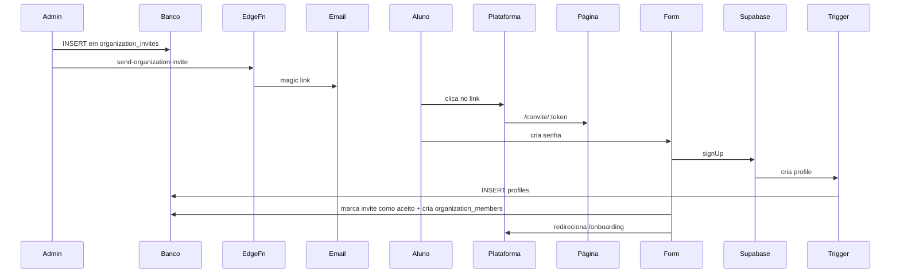

# Módulo 01 — Autenticação

## O que faz

Login, signup, recovery, magic link, OAuth (Google opcional). Base que sustenta todo o resto.

## Arquitetura

**Supabase Auth** gerencia tudo:
- Tabela `auth.users` (gerenciada pelo Supabase, NÃO toca direto)
- JWT token gerado em cada login (válido 1 hora, refresh token válido por 30 dias)
- Cliente JS faz refresh automático

**Tabela `profiles`** estende `auth.users`:
```sql
CREATE TABLE profiles (
  id UUID PRIMARY KEY REFERENCES auth.users(id) ON DELETE CASCADE,
  email TEXT NOT NULL UNIQUE,
  full_name TEXT,
  avatar_url TEXT,
  whatsapp TEXT,
  is_admin BOOLEAN NOT NULL DEFAULT false,
  created_at TIMESTAMPTZ NOT NULL DEFAULT now(),
  updated_at TIMESTAMPTZ NOT NULL DEFAULT now()
);
```

**Trigger automático** cria profile ao criar user:
```sql
CREATE FUNCTION public.handle_new_user()
RETURNS TRIGGER
LANGUAGE plpgsql
SECURITY DEFINER
SET search_path = public
AS $$
BEGIN
  INSERT INTO public.profiles (id, email, full_name)
  VALUES (
    NEW.id,
    NEW.email,
    COALESCE(NEW.raw_user_meta_data->>'full_name', NEW.raw_user_meta_data->>'name', '')
  );
  RETURN NEW;
END;
$$;

CREATE TRIGGER on_auth_user_created
  AFTER INSERT ON auth.users
  FOR EACH ROW EXECUTE FUNCTION public.handle_new_user();
```

## Métodos de login suportados

### 1. Email + senha (padrão)

```tsx
const { error } = await supabase.auth.signInWithPassword({
  email,
  password
});
```

### 2. Magic link (sem senha — usado em convites)

```tsx
const { error } = await supabase.auth.signInWithOtp({
  email,
  options: { emailRedirectTo: `${window.location.origin}/onboarding` }
});
```

Aluno recebe email com link único válido por 1 hora. Click → auto-login.

### 3. Google OAuth (opcional, recomendado)

```tsx
const { error } = await supabase.auth.signInWithOAuth({
  provider: 'google',
  options: { redirectTo: `${window.location.origin}/onboarding` }
});
```

Configurar no Supabase Dashboard → Authentication → Providers → Google. Precisa criar app no Google Cloud Console.

## Páginas

### `/login`
- Form: email + senha
- Botão "Esqueci a senha" → `/forgot-password`
- Botão "Login com Google"
- Link "Recebi um convite" → `/convite`

### `/forgot-password`
- Email → dispara `auth.resetPasswordForEmail`
- Email com link `/reset-password?token=...`

### `/reset-password`
- Form: nova senha
- `auth.updateUser({ password })`

### `/convite/:token`
- Valida token (existe em `organization_invites`?)
- Form: senha + confirmação
- Cria conta, marca invite como aceito, vincula a `organization_members`, redireciona pra `/onboarding`

## Edge Function `set-user-password`

> **Esta função existe pra contornar um BUG do Supabase Auth admin API.**

### O bug

`supabase.auth.admin.listUsers()` retorna **só 50 usuários por padrão**. Se você buscar usuário por email com `listUsers().find(...)` e ele não está nos primeiros 50, você não acha → 404.

Pior: a função admin API quebra com erro 500 quando algum usuário tem `email_change` NULL (bug interno do Supabase).

### O fix

Usar RPC SECURITY DEFINER que faz query SQL direta em `auth.users`:

```sql
CREATE FUNCTION public.get_auth_user_id_by_email(p_email text)
RETURNS uuid
LANGUAGE sql
SECURITY DEFINER
SET search_path = public, auth
AS $$
  SELECT id FROM auth.users WHERE lower(email) = lower(p_email) LIMIT 1;
$$;

REVOKE EXECUTE ON FUNCTION public.get_auth_user_id_by_email(text) FROM PUBLIC, anon, authenticated;
GRANT EXECUTE ON FUNCTION public.get_auth_user_id_by_email(text) TO service_role;
```

A edge function chama essa RPC pra achar o user_id, depois chama `auth.admin.updateUserById(userId, { password })`.

Código completo da edge function em `aprendizados/BUGS-CLASSICOS.md`.

## RLS

### Tabela `profiles`

```sql
ALTER TABLE profiles ENABLE ROW LEVEL SECURITY;

-- Cada um vê e edita o próprio profile
CREATE POLICY "Users can view own profile" ON profiles
  FOR SELECT USING (id = auth.uid());

CREATE POLICY "Users can update own profile" ON profiles
  FOR UPDATE USING (id = auth.uid());

-- Admins veem todos
CREATE POLICY "Admins can view all profiles" ON profiles
  FOR SELECT USING (
    EXISTS (SELECT 1 FROM profiles p WHERE p.id = auth.uid() AND p.is_admin = true)
  );

-- Membros da mesma org veem profiles uns dos outros (limitado)
CREATE POLICY "Members see other members in same org" ON profiles
  FOR SELECT USING (
    id IN (
      SELECT om2.user_id FROM organization_members om1
      JOIN organization_members om2 ON om1.organization_id = om2.organization_id
      WHERE om1.user_id = auth.uid()
        AND om1.status = 'active'
        AND om2.status = 'active'
    )
  );
```

## Fluxo "primeiro acesso via convite"



## Componente `useAuth` hook

```tsx
import { createContext, useContext, useEffect, useState } from 'react';
import { User, Session } from '@supabase/supabase-js';
import { supabase } from '@/lib/supabase/client';

interface AuthContext {
  user: User | null;
  session: Session | null;
  loading: boolean;
  signOut: () => Promise<void>;
}

const Ctx = createContext<AuthContext | null>(null);

export function AuthProvider({ children }: { children: React.ReactNode }) {
  const [session, setSession] = useState<Session | null>(null);
  const [loading, setLoading] = useState(true);

  useEffect(() => {
    supabase.auth.getSession().then(({ data }) => {
      setSession(data.session);
      setLoading(false);
    });
    const { data: sub } = supabase.auth.onAuthStateChange((_event, s) => setSession(s));
    return () => sub.subscription.unsubscribe();
  }, []);

  const signOut = () => supabase.auth.signOut();

  return (
    <Ctx.Provider value={{ user: session?.user ?? null, session, loading, signOut }}>
      {children}
    </Ctx.Provider>
  );
}

export function useAuth() {
  const ctx = useContext(Ctx);
  if (!ctx) throw new Error('useAuth must be inside AuthProvider');
  return ctx;
}
```

## ProtectedRoute pattern

```tsx
import { Navigate } from 'react-router-dom';
import { useAuth } from '@/contexts/AuthContext';

export function ProtectedRoute({ children }: { children: React.ReactNode }) {
  const { user, loading } = useAuth();
  if (loading) return <div>Carregando...</div>;
  if (!user) return <Navigate to="/login" replace />;
  return <>{children}</>;
}

// Uso:
<Route element={<ProtectedRoute><Layout /></ProtectedRoute>}>
  <Route path="/minha-jornada" element={<MinhaJornada />} />
  <Route path="/perfil" element={<Perfil />} />
</Route>
```

## Configurações Supabase importantes

- **Email confirmations**: `Required` (aluno precisa confirmar email — exceto via magic link)
- **Secure email change**: `Enabled`
- **Password min length**: `8` (recomendado, padrão Supabase é 6)
- **Rate limit**: ativar no Dashboard pra prevenir brute force
- **JWT expiry**: 3600 (1h) — refresh token cuida do resto
- **Site URL**: `https://seuapp.com` (sem trailing slash)
- **Redirect URLs**: `https://seuapp.com/**`, `http://localhost:5173/**`

## Templates de email customizados

Substituir templates padrão em `Authentication > Email Templates`:

### Confirm signup
```
Olá!

Bem-vindo ao [Programa]. Confirme seu email pra começar:

{{ .ConfirmationURL }}

Esse link vence em 24 horas.
```

### Magic link
```
Olá!

Aqui está seu link de acesso ao [Programa]:

{{ .ConfirmationURL }}

Esse link vence em 1 hora.
```

### Reset password
```
Você pediu pra trocar sua senha do [Programa].

Crie uma nova aqui:

{{ .ConfirmationURL }}

Se não foi você, ignore esse email.
```

## Checklist de implementação

- [ ] Tabela `profiles` criada com trigger
- [ ] RLS de `profiles` aplicado
- [ ] Página `/login` funcional
- [ ] Página `/forgot-password` + `/reset-password`
- [ ] Página `/convite/:token`
- [ ] Edge function `set-user-password` deployada (com fix do bug)
- [ ] Edge function `send-organization-invite` deployada
- [ ] Email templates customizados
- [ ] Rate limit configurado
- [ ] Google OAuth (opcional)
- [ ] AuthContext + ProtectedRoute funcionando
- [ ] Logout limpa cache do React Query

## Próximo módulo

`02-ORGANIZACOES.md` — multi-tenant, papéis, convites, seats.
